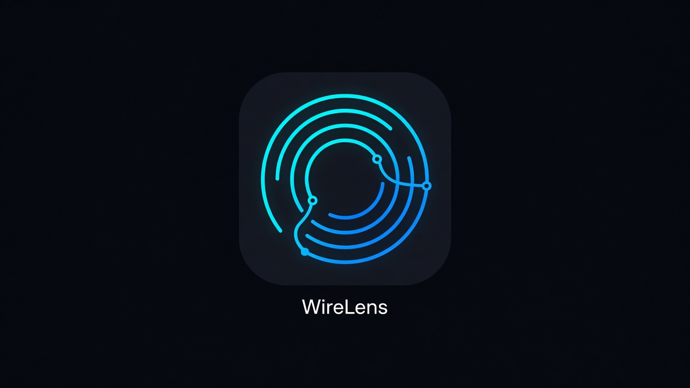

```
 __        ___          _                   
 \ \      / (_)_ __ ___| |    ___ _ __  ___ 
  \ \ /\ / /| | '__/ _ \ |   / _ \ '_ \/ __|
   \ V  V / | | | |  __/ |__|  __/ | | \__ \
    \_/\_/  |_|_|  \___|_____\___|_| |_|___/
         See what your PC is talking to
```

# WireLens

<p align="center"></p>

**Free for everyone to use.** Optional donations help cover Ardean’s costs — this is not a paid product and not a cloud security service.

**See what *this computer* is talking to** — which programs are connecting to which hosts on the network — in a dark local dashboard. No SIEM, no subscription, no sending your traffic to someone else’s cloud.

> **Two different apps:**  
> - **Windows / PC WireLens** (this repo) — run with `start.bat` on your computer.  
> - **WireLens Phone (Android)** — a separate `.apk` you install on your phone (see below).  
> They are not the same download. Do not expect `start.bat` to work on a phone.

## Download the Android app (phone)

Use this only if you want the **phone** app. On a PC you want the Windows steps further down.

1. On your **phone**, open **Chrome** and go to the Releases page:  
   **https://github.com/ardean1/wirelens-android/releases**

   Direct APK (Chrome on phone):
   **https://github.com/ardean1/wirelens-android/releases/download/android-debug-2026-09-15/WireLens-debug.apk**
2. Open the **latest release**.
3. Tap the file named **`WireLens-debug.apk`** (or `WireLens-….apk`).
4. If Android asks, allow install from Chrome / that source → tap **Install**.
5. Phone menus differ by brand — if stuck, search: `sideload APK` + your phone brand/model (Samsung, Pixel, Motorola, etc.).

Until the first GitHub Release is published, a locally built debug APK may also exist on the build machine as **`/workspace/WireLens-debug.apk`**. Prefer the Releases link once it is live.

**Play Store listing may come later** for WireLens Phone (`com.ardean.wirelens`, targetSdk 36). Until then, install from GitHub Releases (plain steps above). Debug sideload APK ≠ Play release AAB.

The phone app uses a **local VPN-style monitor** (you must approve Android’s VPN prompt). It does **not** decrypt HTTPS and is **not** antivirus. Traffic stays on the device.

## What WireLens (Windows) shows

WireLens lists **live network connections** from this PC:

- Which **program** (process name / PID) opened the connection  
- Where it is talking (**IP address**, and a hostname when reverse-DNS finds one)  
- Port, protocol (TCP/UDP), and connection state  

Think of it as a clearer window into “who on my PC is calling out,” not a security guard that blocks threats.

## What “suspicious / unwanted” means here

Flags are **simple heuristics** — hints for a human to look twice — **not** malware detection and **not** antivirus.

Examples of what may get flagged:

- A remote address with **no hostname** (unknown destination name in our cache)  
- An **unusual port** (outside a short list of common services)  
- A process that opened **many short-lived** connections quickly  
- A hit on an **optional blocklist** you maintain yourself  

**What to do next (don’t panic):**

1. Note the **process name** and the **remote host/IP**.  
2. Ask: is this app supposed to be online? (browser, updater, game launcher, cloud sync — often yes.)  
3. If you do not recognize the process, look it up from a trusted source or check whether you installed it.  
4. WireLens does **not** quarantine or remove software — it only helps you see and decide.

## Why it’s useful

- **Catch surprises** — unknown processes, odd remote ports, CGNAT/cloud endpoints, short-lived connection bursts  
- **One-host visibility** — see this PC’s connections when you do not want a full IDS appliance  
- **Transparent rules** — every flag is explained (`GET /api/rules`); no fake “threat scores”  
- **Works offline-first** — binds **localhost only** by default (`127.0.0.1:8787`)  
- **Demo mode** — try the UI without admin privileges  

**Not a perimeter IDS.** WireLens only sees what this host can see via its own sockets (`psutil`). Heuristics are for triage, not malware verdicts.

## Windows — download, run, and close (PC start here)

### 1. Download the Windows package
1. Open this project’s GitHub page in a browser (prefer the official Ardean repo / Releases).  
2. Get the source ZIP **or** a Release asset if one is published:  
   - Easy path: open **https://github.com/ardean1/wirelens/releases** if Releases exist, **or** on the repo page use **Code → Download ZIP**.  
3. Save the ZIP somewhere easy, like your **Desktop** or **Downloads**.

### 2. Extract and keep the folder
1. Right-click the ZIP → **Extract All...** (or open it and drag the inner folder out).
2. Put the extracted folder somewhere permanent, for example your Desktop:
   - Desktop\wirelens
3. Open that folder until you see **start.bat**, **start-live.bat**, and the **wirelens** folder.

### 3. One-time: install Python (if you do not have it)
1. Install **Python 3.10 or newer** from https://www.python.org/downloads/
2. On the installer, check **Add python.exe to PATH**.
3. Finish install, then continue below.

### 4. Launch
1. Double-click **start.bat** for **demo mode** (safe first try — sample traffic so you can learn the screens).
2. Or double-click **start-live.bat** for **real** connections on this PC.
3. A black **Command Prompt** window opens — **leave it open** (first run may install packages into a local `.venv` folder; wait until it finishes).
4. Open a browser to http://127.0.0.1:8787/

### 5. Close properly
1. Close the **browser tab** for WireLens (optional but tidy).
2. Click the **Command Prompt** window that is running WireLens.
3. Press **Ctrl+C**, or click the **X** on that window.
4. That stops the dashboard. To use it again later, double-click **start.bat** or **start-live.bat** again.

**Tips:** Keep the folder; do not run from inside the ZIP. If the window closes immediately with an error, install/reinstall Python with PATH checked, then retry.

### Advanced (optional)
```bash
python -m venv .venv
# Windows: .\.venv\Scripts\Activate.ps1
pip install -r requirements.txt
python -m wirelens --demo
python -m wirelens
```


## Cost / API keys

**No cloud API keys. No Grok Bot / Cursor session is used when you run WireLens.** It only inspects the machine it runs on. Other people running copies do **not** create usage charges for the author.

## Trust & security

- Runs **on your PC**; default bind is **localhost only**
- No publisher cloud account, no paid API keys baked into the app
- Heuristic flags are explained in-app (`GET /api/rules`) — not secret “AI threat scores”
- See [SECURITY.md](SECURITY.md) for the policy and how to report vulnerabilities privately
- Prefer this GitHub repo (or Releases) as the download source

## Optional support

Tips are **100% optional**.

| Method | Handle |
|--------|--------|
| Cash App | [$AnthonyDean16](https://cash.app/$AnthonyDean16) |

## Features

- Live connections: addresses, ports, protocol, state, process name/PID/exe, first/last seen
- DNS panel: reverse-DNS cache with TTL
- Suspicion rules: `raw_ip`, `many_short`, `unusual_port`, `cgnat_or_public`, `blocklist_hit`
- Search / “flagged only” / detail drawer / WebSocket ~2s / CSV export
- Optional blocklist file (`blocklists/example.txt`)
- In-dashboard **“Unwanted connections?”** help callout

## API

| Endpoint | Description |
|----------|-------------|
| `GET /api/health` | Liveness + counts |
| `GET /api/connections` | Connection snapshot |
| `GET /api/dns` | Reverse-DNS cache |
| `GET /api/rules` | Suspicion rule catalog |
| `GET /api/export.csv` | CSV download |
| `WS /ws` | Live snapshots |
| `GET /` | Dashboard |

## Tests

```bash
pip install -r requirements.txt
pytest
```

## License

App code: [MIT](LICENSE).

## Credits

Built by **Tony Dean** (Ardean).

Assisted by **Grok Bot** — [https://x.ai/bot](https://x.ai/bot) · download: [https://cursor.com/download/bot](https://cursor.com/download/bot)
